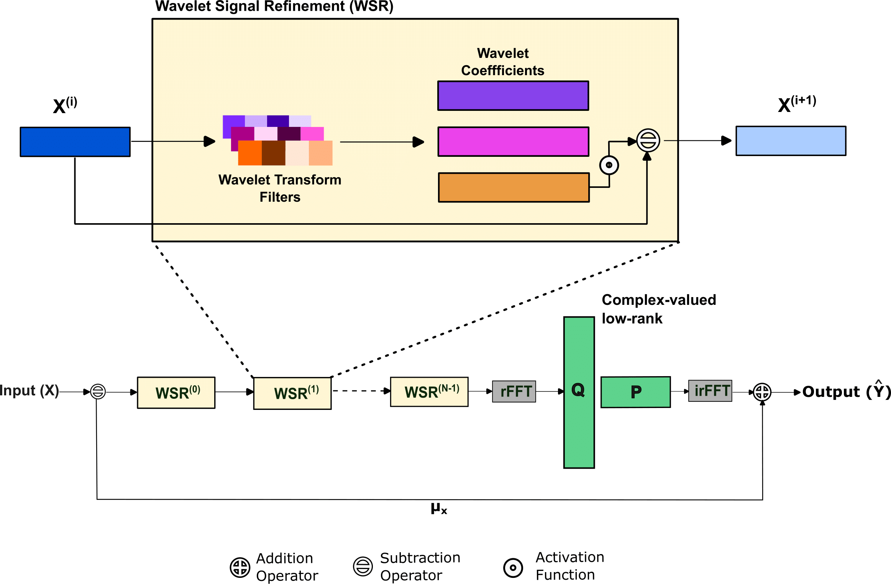
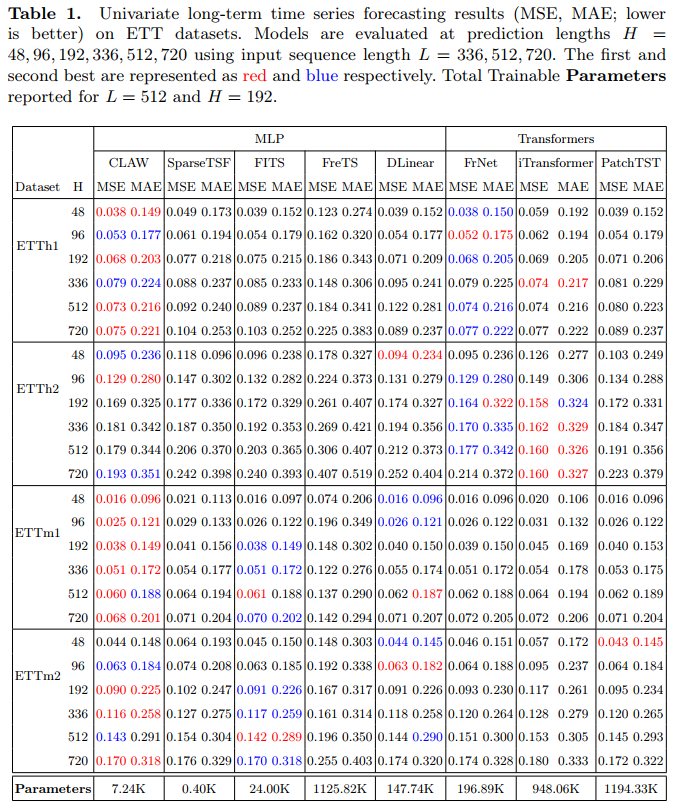

# CLAW: Complex Low-rank and Wavelet Transform for Univariate Long-term Time Series Forecasting

## Overview
CLAW is a lightweight, PyTorch-based framework for Long-term Time Series Forecasting (LTSF), designed to combine shift-invariant noise suppression with parameter efficiency. Built on the Stationary Wavelet Transform (SWT), CLAW progressively filters high-frequency noise by discarding one coefficient at each decomposition stage, preserving temporal alignment without downsampling. The denoised signal is transformed via real-valued FFT (rFFT) and processed by a novel complex low-rank linear layer, reducing parameters compared to full-rank designs while maintaining expressive capacity. An inverse rFFT reconstructs the forecast. Evaluated under a univariate, channel-independent setting for clearer attribution of design impact, CLAW achieves comparable or superior accuracy to larger Transformer baselines with only a fraction of their parameters, offering an efficient and effective solution for long-horizon forecasting.



## Key Features
- **Wavelet Signal Refinement Block**: Ensures shift invariance while progressively filtering high-frequency noise by discarding one coefficient at each stage leading to signal refinement over multiple blocks.
- **SWT-like Wavelets**: Allows 1D convolution to operate like stationary wavelet filters with no regularization making them more adaptible to time series dataset that can capture detail level information to discard and refine signal aligning with classical wavelet theory.
- **Complex Low-Rank Linear Layer**: Captures global frequency patterns in complex domain maintaining expressive power with reduced parameter compared to full-rank real-valued linear layers.
- **Lightweight Design**: Delivers accuracy on par with large Transformer models while using only a fraction of their parameters.

## Usage

### Initialization
The model can be initialized with a configuration object that specifies various parameters such as sequence length, prediction length, number of channels, rank for low-rank approximation, and flags to enable/disable Haar, DCT, iDCT and low-rank.

```python
configs = {
    'seq_len': 512,
    'pred_len': 96,
    'enc_in': 1,
    'individual': False,
    'extractor_depth': 4,
    'no_of_filters': 2,
    'filter_size': 8
    'rank': 15,
}

model = Model(configs)
```
### Configuration Options
| Parameter       | Description                                    | Default |
|---------------|--------------------------------|---------|
| `seq_len`     | Input sequence length                         | -       |
| `pred_len`    | Output prediction length                      | -       |
| `enc_in`    | Number of input features                      | -       |
| `individual`  | If True, applies a separate layer per feature | False   |
| `extractor_depth` | Number of WSR Blocks                    | 4    |
| `no_of_filters`  | Number of filters/channels per WSR Blocks             | 2     |
| `filter_size`  | Kernel size of filters in WSR Block (even only)    | 8    |
| `rank`        | Rank of the complex low-rank layer                    | 15      |

### Forward Pass
The forward method takes an input tensor of shape `[Batch, Input length, Channel]` and returns an output tensor of shape `[Batch, Output length, Channel]`.

```python
input_tensor = torch.randn(512, 96, 10)  # Example input
output_tensor = model(input_tensor)
```

# Results



# Acknowledgement
The listed github repositories have been used for code bases, datasets and comparisons.

- https://github.com/zhouhaoyi/Informer2020
- https://github.com/lss-1138/SparseTSF
- https://github.com/cure-lab/LTSF-Linear
- https://github.com/aikunyi/FreTS
- https://github.com/luodhhh/ModernTCN
- https://github.com/yuqinie98/patchtst
- https://github.com/thuml/iTransformer
- https://github.com/SiriZhang45/FRNet


## License
This project is licensed under the MIT License.